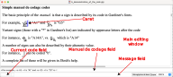

The JSesh editor window looks like that:

Currently, JSesh's working space contains a menu, a main editing window, and a number of fields. 

- The field termed “Manuel de Codage field” contains the Manuel de codage code for the current line of text (the one pointed by the cursor). You can modify directly this code, **but it's certainly not the standard way of using JSesh.
- the field termed “current code field” is used in interactive editing to show the code for the currently edited text. 
- the field directly right to it is a message field. It isn't of much use currently.

