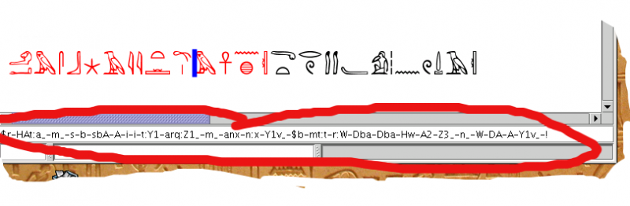

When a text is displayed, the manuel de codage codes for the current line are shown in a text field Direct editing

This field is not here just for the sake of the Manuel beauty. In fact, you can edit its content, and the text in the hieroglyphic window will be modified accordingly when you validate (by typing the Enter key). Note that incorrect Manuel de codage code will be refused.

I tend to use this system only in a few cases (for instance, when fixing errors in 'latin' text.
