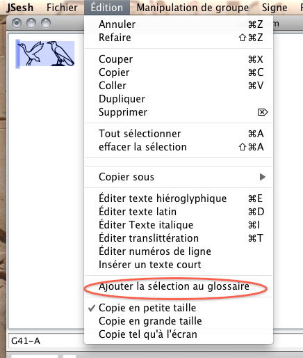
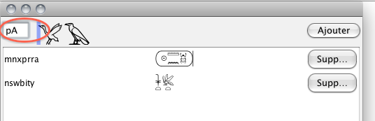

The glossary editor allows you to create precomposed groups (even words or sentences) and retrieve them easily for quick typing.

Suppose you would like to be able to type the article pꜣ in its hieratic form, which is `G41-A` G41-A, simply by typing "pA". 
Here is what you need to do:
type the text for the group you want.
select it, and call "Edit/Add Selection to glossary"

the glossary editor window opens, and all you need to do is to type the code you want to use, and then push the "add" button. 

as soon as the group has been added, you can insert it by typing its code, just like you type the code of a sign.
In this precise case, as we used "pA" as code, and "pA" allows to type G41 and G40, the space bar will allow you to cycle through all solutions.

## Complements

* you can remove entries by clicking the "remove" button which follows them in the glossary editor.
* you can open or close the glossary editor by using the "Window/Glossary" menu entry.