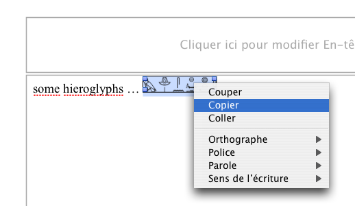
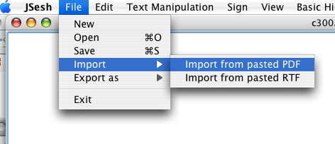
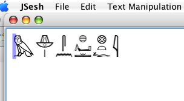
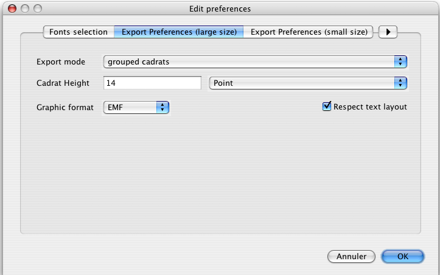
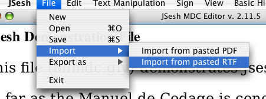
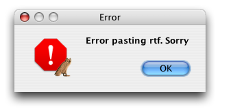
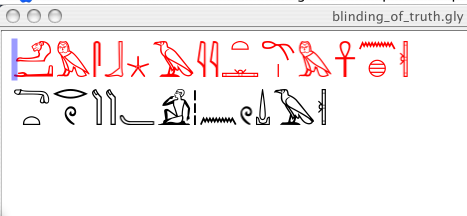

As of version 5 and later, copy and paste can be used to transfer data between Jsesh and other applications. You can :

* Copy/paste between different windows in JSesh itself.
* Copy text and signs to a word processor (it works with both openoffice and Word)

## Copy and paste : configuration

Often, one needs two sizes of signs in an application: one for main text, and a smaller one for footnotes. JSesh allows one to keep two configurations for copy and paste. The current size can be selected in the edit menu : simply choose "copy: small size", "copy: large size" or "copy: wysiwyg" (the latter should be used if you want the copied glyph to retain the same disposition as the original ones).

### Format choice

A cut and paste involves two softwares : JSesh and your word processor (Word, Openoffice, etc.) 
Now, JSesh will propose a number of different *formats* to your word processor, letting it pick the one it likes the most. To control what will be proposed by JSesh, you can use the Format Choice dialog (in the preferences).

I do most of my testing with **open office** and **libre office**. They are not perfect, but they tend to process pictures and unicode correctly, so I strongly encourage their use. Their files tend to be very portable from one computer to the other. No problem of different versions of the word processor there.

{{ http://jsesh.qenherkhopeshef.org/files_jsesh/images/formatChoice.img_assist_custom.png |Format choice dialog}}

RTF
: probably the most versatile choice for now. Works (almost) everywhere and give reasonable results, especially for hieroglyphs mixed with    alphabetic text. Used to be problematic with some versions of Word on Mac, but has recently (2016) improved.

PDF
: currently the most accurate choice. As far as I know, only Mac OS X supports PDF cut and paste, and few softwares understand it. For instance, Word 2004 doesn't. Word 2008 does, however. Textedit has the bad idea of accepting the PDF cut and paste, but transforming the result into a bitmap.

bitmap
: gives a (currently) low resolution bitmap, suitable for web pages for instance.

plain text
: will copy the *Manuel de Codage* encoding to the clipboard.

For information specific to **your** word processor, see the chapter on [[word_processor_issues|word processors issues]]

### Fine settings

The settings for "large size/small size/wysiwyg" can be changed in the preferences. There are two tabs, one for "small" and the other for "large" size. The "wysiwyg" mode uses the "large size settings".

{{ http://jsesh.qenherkhopeshef.org/files_jsesh/images/cut_and_paste_preferences.img_assist_custom.png |Cut and Paste Preferences}}

"Cadrat height" changes the size of the pasted hieroglyphic text. "Export mode" allows you to chose how hieroglyphic text will be pasted in RTF exports. There are three options:

* **as one large picture** The whole selected text will be pasted in your word processor as a single picture. This is fine for text in columns, for instance, or if you want to keep the graphical layout. It also seems that most word processors prefer to handle large pictures than lots of small ones.

* **grouped cadrats** Adjacent hieroglyphic cadrats will be grouped in one picture. The resulting text will alternate normal text and large pictures.

* **one picture per cadrat** The pasted text will contain normal text and pictures for the hieroglyphic text. But then, each cadrat will be rendered as one picture. This is fine for line-cutting, and might be interesting if you mix text and hieroglyphs.

### Cut and paste limitations

Due to technical issues, we have put a limit on cut and paste. It's not possible to paste very long texts in a word processor (you can "export as RTF instead"). We will try to improve it, but we think it's a minor nuisance, as one typically paste small parts of hieroglyphic texts rather than whole large document (the limit is currently 1000 cadrats).

Don't hesitate to write to the author about this (or other problems with JSesh).

## Advanced "copy" menu 

Normally, in JSesh, you chose the format you want for copy/paste in the preferences menu. But in some cases, you might want to copy your text in a specific format which is not the one you chose. Instead of going back to the preferences, you can use the "Copy As" menu. It allows you to copy the selected text in PDF, RTF or Bitmap.

## Possibility to paste hieroglyphic back text to JSesh

### Principles and problems

I'm sorry, this part is a bit technical. If someone is able to write the same explanations in a clearer way, it would be a welcome contribution to JSesh's site

On windows (and on Mac OS prior to Mac OS X), there is a feature called "Object linking and embedding", wich is more or less an intelligent cut and paste. You copy/paste a document from your hieroglyphic editor into Word, and then if you double click on the pasted picture, it will open the hieroglyphic editor, so that you can change the text.

This is not possible with JSesh, as this kind of capabilities are very system-specific (If you really need it, I understand that it's well supported in Inscribe). However version 2.11 of JSesh provides a poor man's version. Basically the trick (also used in a few other hieroglyphic editors, like MacScribe) is to use the comment field available in some picture formats (like PDF or EMF), and to put the manuel de codage text in this comment field. When the picture is pasted into JSesh, one can simply extract the code.

Of course, this is more or less automatic. But I needed to explain it, because it depends on a number of factors:

* the picture format must support comments, and I need to write the corresponding code. This is currently done only for EMF and PDF.
* the word processor must accept the pasted picture "as is", and not modify it. Modifications usually suppress the comment. For instance, on a Mac, you can paste a PDF picture in MS/Word 2008. But Word will (I guess) transform the picture into its own format, and lose the comment in the process.

All those explanations to tell you that this system won't function with all word processors... and especially not with MS/Word (at least not with Word 2008 on a mac). I'm sorry for that.

Now for the possible solutions

### Mellel/Nissus writer and PDF

If you use Mellel or Nissus writer (and if you configure your cut and paste option to use the PDF format), you will be able to paste back your hieroglyphs into JSesh.

Simply select the hieroglyphs in your text processor (e.g. Mellel) and copy them...

Then go to JSesh, and select File/Import/Import from Pasted PDF.

The result will replace your current JSesh document:

### NeoOffice (Openoffice) and RTF text

This chapter describes manipulations made on a macintosh using Neooffice as word processor. It works also with Openoffice on Windows and Linux (but it seems to fail with Openoffice 3.1.1 on Mac).

If you configure your cut and paste option to use the RTF format **and** if you chose **EMF** as the picture format (see above), you will be able to paste back your hieroglyphs into JSesh.

First, you must select "EMF" as the copy format to use.

Text pasted in EMF in Neooffice  can then be pasted back in JSesh:

Now, there is a little problem. We want Neooffice to send RTF text (with the picture embedded in it). This won't happen if you directly select the picture:

Note that in the "good" selection, the picture is outlined in black.

The direct selection of a picture will result in an (innocuitous) error message:

Now, the correct way to select the picture is to click in front of it in the text and to drag with the mouse. 
Alternatively (and with less dexterity), you can select the picture by moving the text cursor in front of it and then pressing "shift" and one of the keyboard arrows (it's way simpler to do it than to describe it).

Note that you can select more than one picture:

And you will get one line by picture in JSesh:

Please **note that this only works if your pictures have been pasted from version 2.11 or more of JSesh, and in  the correct format**.

### Others

I would be very interested to know if other configurations work