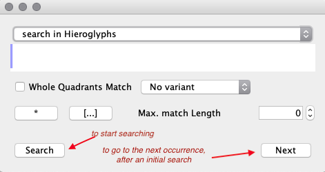
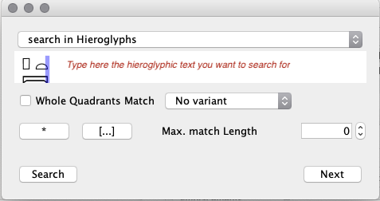
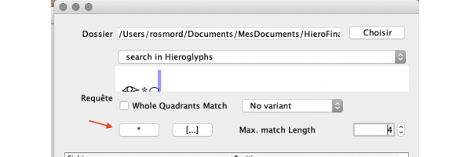
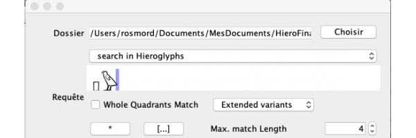
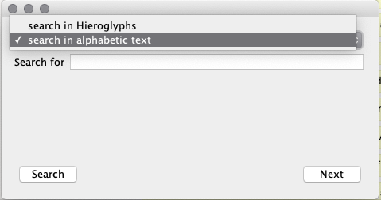
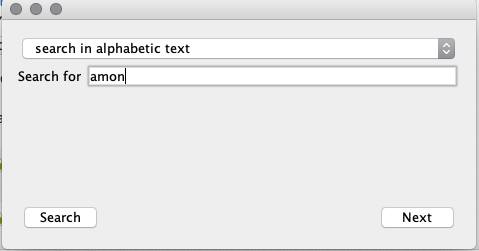
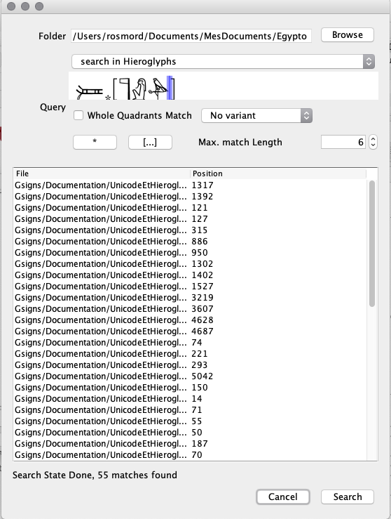

Since JSesh version 7.2, it's possible to search in JSesh document (it was about time!).

It's possible to search either in the *current* document or in all the JSesh documents contained in a given folder.

## Searching in the current document

To Search in the current document, you can use the menu entries:

- **Edit/Find** to open the "Find" dialog
- **Edit/Find Next** to search for the next occurrence of a search.

You then need to describe what you want to search. JSesh is quite powerful here. You
can both search for hieroglyphic and non-hieroglyphic text.

## Searching for Hieroglyphic Text

Searching for hieroglyphic text can be quite simple. Type the text you are looking for in the search field (see picture below), and press the "search" button.

By default, the search will look for *sequences* of signs, regardless of their layout. If you want to search
for a specific layout, check the **Whole Quadrant Match** box.

## Advanced Search for Hieroglyphic Text

You will notice a number buttons below the text field. They allow you to include more variability in the text you are looking for.

### The `*` wildcard

The `*` button allows you to search for sequences of non-strictly consecutive signs. For instance, ir`*`t will search for sequences of signs containing ir`, then possibly a number of other signs, then t. 

As the search will find any corresponding sequence of signs, *regardless of its length*, you may end up with unexpected results - matching a ir in the second line of your text, and a t in the fiftieth. To avoid this, you can 
limit the length of the expected result. For instance, if you want to allow at most two signs between 
ir and t, you may limit the result length to four signs, as is done in the example above, using the **Max match length** field.

A search string can contain multiple "*" if you want.

If **Max match length** is 0, it will be understood as "no limit".

**note:** the "*" wildcard has nothing to do with the *Manuel de Codage* code "*" for grouping signs.

### The `[...]` button

This buttons allows you to introduce variation in the signs you want to find. The system will search for any **one** of the signs between the [...].

For instance, "p[W-w]" will search both for p-Wand for p-w.

### Variants in searches

If you select "Extended variants", search result will include texts which contain **any** variant of your signs **as recorded in JSesh.**

As W and w are considered as variants, the following search will find occurrences of both p-W and p-w.

Compared to the use of [...], this system is less precise; [...] allows you to specify exactly what you are looking for. It might be more exhaustive in some cases. It's however dependent on the quality of JSesh sign descriptions. The current information about variant is still very lacunar - sign descriptions require a lot of work.

Any kind of recorded variants will be used, as well as variants of variants. It is expected that a more precise system will be implemented at some point.

## Search in non-hieroglyphic texts

Search is no longer restricted to the hieroglyphs. If you have typed translation or transliterations, you can search them too...

Select **search in alphabetic texts**...

Then type your text (search will disregard case) :

## Search in folders

This is a very powerful feature of JSesh : it can search in all the glyph files contained in a folder (and its sub-folders). In a way, you can use your texts (including translations typed in JSesh) as a kind of rough linguistic database.

To use this function, use the menu **Edit/Find in Folder**. Then select the "root" folder for your search. 
In the example below, I'm looking for attestation of Atum, using a fairly generic wildcard. Note the use of [...] to include variant signs (some possible determinatives are however missing in this search, I leave it to the interested reader as an exercice). Also note the length I have set to limit the *false positive* results. Remember that this length includes the whole result, not only the part skipped over by the "*".

Once the search is started, the occurrences will appear in the list below the search form. **Double-clicking on an occurrence will open the corresponding document.**

