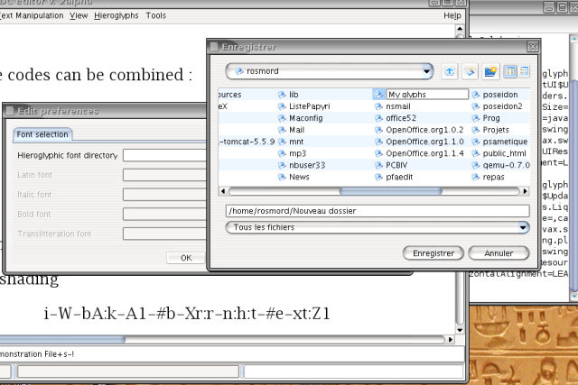
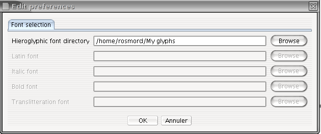
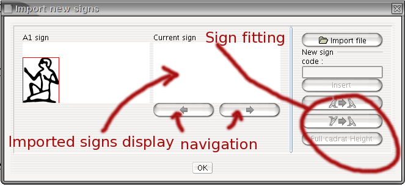
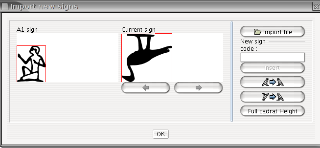
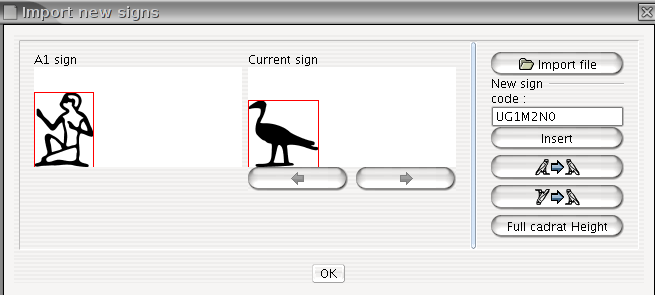

## Choosing a folder for your signs

In order to be able to add new signs, you must first choose where they will be stored on your computer. To do this, simply select Tools/Edit Preferences
In the "Font Selection" tab (currently the only one available), enter the folder you want to use in the "Hieroglyphic font directory" field. You should create an empty folder for this specific purporse.

Creating a folder:

Selecting the folder:

You only have to do this once. Next invocations of JSesh will use this folder.

## Attaching codes to drawings, and inserting them in JSesh

Once you have drawn a sign, or got it from the [JSesh sign library](https://jsesh.qenherkhopeshef.org/glyphs) or some other source, it's time to give it a name.

Except when you are creating signs which are already documented in the Manuel de Codage (for instance, because they are not available in JSesh), you should first get a user ID, which will differentiate your signs from the signs created by other users.

to get an uid, register as JSesh user. Note for tksesh users: the uid is simply your tksesh id.

Be careful when giving signs a name. You want your files to be readable by anyone, so be faithful to the *Manuel de codage*. Our current suggestions are the following:

* If you create your own version of a sign in the Manuel (either because it isn't available in JSesh yet, or you don't like the default sign provided, use either the standard Manuel de codage for the sign, or use the following notation: `US` + **uid** + `Gardiner code`, where **uid** is the user id. For instance, if you have user id 527834, it would be `US527834A1VARA` for a variant of `A1`.

* When you create a sign which you consider as a variant of a standard sign, you should build its name like that: **USuid+Gardiner Code+"VAR"+VARIANT CODE** where : 
  * Gardiner Code is the standard Manuel de codage code for the base sign 
  * VARIANT CODE is usually an uppercase letter. 

  e.g. the usual shape of wn (E34) in Ramesside times has the tail of the Seth animal. If I want to distinguish it from the "normal" sign, I can call it `US1E34VARA`.

* When the sign you create corresponds to a completely new sign, give it a code of the form: **USuid+Gardiner Category + NUMBER +"XT"+OPTIONAL VARIANT CODE.**

You are free to choose the number you like, but I would suggest you try to find a logical layout. It would also be better if this number does not correspond to a "standard" sign (to avoid confusing innocent users of other softwares), So you can for instance start your numbering at 1000. Note also that the number should not contain leading zeros. The Category should be correct, and if you really don't have a clue, you should use the Aa category. "Ff" is reserved for signs used specifically when transcribing hieratic.

  Example : the Harp Louvre E 116 A has recently been published by C. Barbotin (La voix des hiéroglyphes, p. 66-67), and in its text appears the unknown sign . I can create this sign, and give it, for instance, the code US1Aa1000XT. On the other hand, the Israel Stela contains a sign which is most probably a griffin, but does not correspond to any registered griffin sign in the manuel US1E162VARA. So I gave it the code US1E162VARA, because E162 is a griffin sign.

* Using this system when importing texts from other softwares: it is possible that other softwares provide their own “non standard” codes. If you want to import texts from those software into JSesh, you might need to give a name to the new signs they contain (note that fonts are usually protected by copyright laws, so you will need to redraw the signs yourself, either by adaptating existing JSesh signs or by finding a picture of the signs in original hieroglyphic sources). For compatibility purposes, the following user id codes can be used for other softwares: 

| software    | user id substitute |
| ----------- | ------------------ |
| winglyph    | 1000               |
| macscribe   | 1001               |
| inscribe    | 1002               |
| got         | 1003               |
| visualglyph | 1004               |

If you think of other softwares I should add, please tell me.
  
* standard manuel de codage code. You will find these codes in Hannig's WB, for instance. A number of lists are also available on the web. Please, note that using the codes is one thing, but that the actual signs drawing in the fonts of other softwares are legally protected. So, have to come with you own versions of the signs, either from actual sources or by re-creating them. You will find more information on signs drawing in the next section. In our example, your duck would replace the normal one, so it would have code "G39".

We suggest that, if you create a sign with an “normal”  gardiner code, you also give it an user sign code. This way, you will be sure to keep it even it a sign with this Gardiner code is later added to the software.

Note that for compatibility with tksesh, we also support arbitrary "user glyph codes". These codes correspond to the codes tksesh gave to new signs. User glyph codes have the form **UG id M mid N sid** , where id, mid, and sid are numbers. Avoid using those codes for now.

## Actual sign insertion

## JSesh-ready signs

The simplest way to add signs to your library is to create SVG files with the right size. You should use a dimension for the whole quadrant of 1800px x 1800px. Of course, the picture might be smaller if the glyph does not occupy a whole quadrant.

JSesh can also use signs with a base quadrant size of 18px, but I'd suggest avoiding it.

Your SVG file should have a name which corresponds to a code (say, `US1A1VARA.svg`). 

In this case, you can simply copy your file in your JSesh Hieroglyphic folder, and the sign will be available.

## Alternative system

There is also a secondary system, which can help you resizing the signs and choosing a correct name. I admit I haven't used it for ages.

The sign import interface can be started from the menu Tools/add new signs .

Sign import is done in two phases :

* you import a picture or set of pictures from some file (svg drawings, truetype fonts, etc.)

* you assign a code for each sign you have imported, and then you insert the new sign in the JSesh list of signs.

### Importing drawings

Importing drawings is easy. JSesh can read:

* true type fonts 
* .tml and bzr files, which can be created with JSesh's forerunner, tksesh. 
* SVG files

Simply click on the "import file" button, and select the file which contains your picture(s). You can use the navigation buttons (those with arrows) to browse the available signs.

### naming your sign

You must then name your sign. JSesh will try to guess a name from the file name, but it might get it wrong.

**Note** Giving a name doesn't mean the sign has been saved in your library. Nothing is done when as long as you haven't pressed the insert button.

### Fine tuning your signs

In some cases, the size or orientation of your signs won't be correct. For instance, in the picture below, the duck is too large and its orientation is wrong.

You can correct this :

* the buttons  and  can be used to change the sign orientation;
* the button "Full cadrat height" gives the sign the same size as the A1 sign;
* if you click on the sign's window and drag the mouse, the mouse position will set the sign's height.

When your sign is ready, **click on the insert button**. If you don't, nothing will happen.

