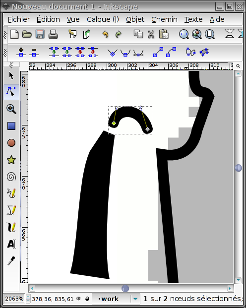
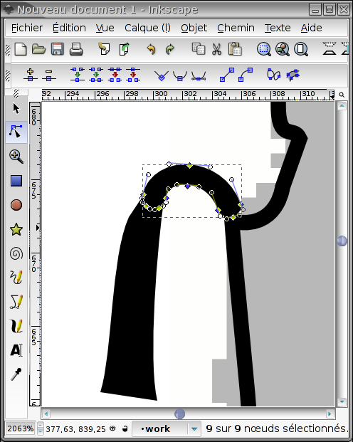
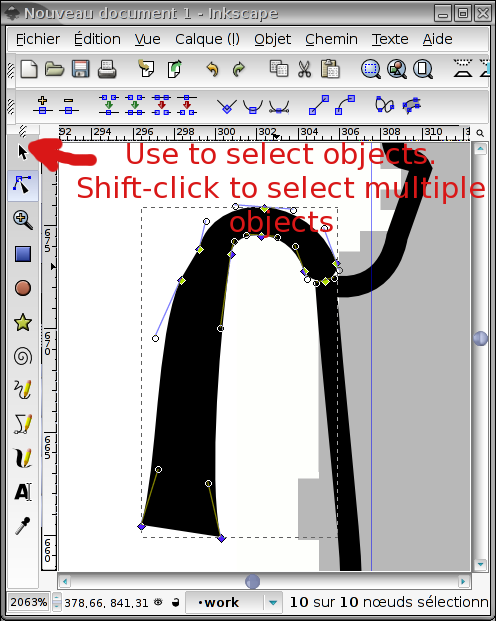
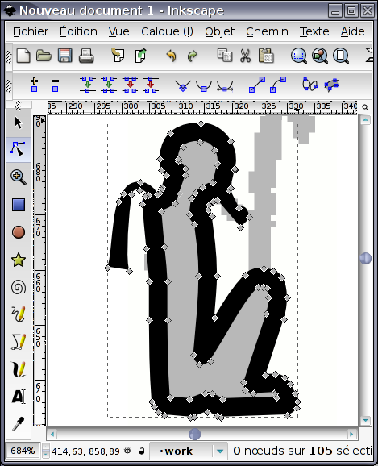

## Introduction

JSesh doesn't include a hieroglyphic editor yet. However, it can include signs drawn with a number of other softwares, like fontforge and inkscape. Even if a sign editor is added, this functionality will be kept.

In this tutorial, I show how to use the Inkscape software to create a new hieroglyph.

Drawing a new sign is a rather long and tedious task. It requires a basic understanding of vector graphics (Inkscape, adobe illustrator...), which is not trivial, and it also requires a lot of work anyway. Not only should you draw nice signs, but those signs should blend with the other fonts.

## A few notions about vector drawing

Drawing vectorial pictures requires some understanding of what it's all about. We will write something about it later (except if some kind soul can contribute a nice free-of-right tutorial).

Requirement for JSesh-usable signs : you should draw your signs as black filled contours on a white background. The JSesh import module can read non filled contours, but the import will give better results with filled contours with zero width. Inkscape is able to convert curves into contours, so it's not a very heavy requirement.

## Creating a background image

You can start by getting a picture of the glyph you want to create. This picture might be a line-drawing, or a photograph from an actual glyph. You want the black lines of your sign to be readable, so change the colors if needed (for instance, if you have a line drawing of the sign, color it in light gray).

Our example will be a low resolution rendering of sign C102 (seated Ptah with wꜣs) from Israel stela. The original bitmap is . With a drawing program, we have dimmed the picture to get .

## Draw the outline

We now start Inkscape, and import the bitmap drawing in it. Create a new layer, call it "work". That way, we won't disturb the bitmap drawing.
We are then going to draw a rough outline of the sign's shape.
As we are not great drawers, we use the "Bezier curve" tool to do it. We get the following result:

Note that we have selected "no fill" and a small contour width. We have also left the "Was" sign alone.

## Fit the outline 

Straight line segments won't make a great sign. So we convert some of them to curve, we add new points if needed, etc...
We start with the head...

And here is the result:

 

## Working on details

We want our signs to be readable at small size, so we won't fill to much details.

## Ptah's beard

The outline of Ptah's body will be enlarged to make the final sign. But we would like the beard to be filled((in this case, we gave Ptah an osirian beard, which is an error)). Hence, we must separate it from the rest of the drawing. This is done by selecting the control points which separate the beard from the body:

And then selecting the "Break apart" entry in the "Path" menu, which gives us two objects : the beard and the rest of the body.
We can then fill the gap we have just created (and give Ptah a chin) :-).

Now, the beard should also be closed. We edit the fill and stroke characteristics of the beard, and we give it a solid black filling, and no stroke. If the beard is too thin, we will be able to dilate it with the "outset" action of the path menu.

## Ptah's necklace counterpoise

For this one, the original scan is a bit rough. We dig some iconography, and we come with a two parts necklace counterpoise.

The necklace is made of two parts: a string, and the counterpoise itself. The string is a simple curved stroke, and the counterpoise is a filled path.

We want to join them into one object, which will be a filled path. To do this, we first convert the string into a stroke.

We then select the two parts of the necklace, and use the "union" operator in the "path" menu.

## Choosing the right line width

At this stage, you might want to save your work twice. Once as a backup, and, one, of course, as your working file. Now, select the main drawing, and choose a reasonable stroke width for it. It should mix well with the rest of the fonts. It might be interesting to zoom out in order to see the sign as it will be rendered.

## Uniting everything

Now, get sure all strokes are transformed to path, and use the union operator on them. You should get:

I strongly suggest you keep a backup version of your sign in which strokes are not tranformed to path, it will allow you to rework your sign more easily, or to reuse it as part of other signs. That's what I do for my Ramesside fonts. 

## Adding other details

Using the same techniques, we get to the final result:

which we save under the name `C102.svg` .

## Final comments

From a rather low resolution picture, we can get a decent-looking glyph. Remember that the sign will be rather small, and don't add too many details (giving the possibility to increase the sign's details with its size is an interesting option, which is used in the Gardiner's lead fonts). Try to mix with the existing signs.In fact, if you have SVG sources for similar signs, try to reuse them.

The sign given in this example is not too good an example. The "Wꜣs", for one, is too high, and the sign won't mix well with the existing fonts. So we should make the scepter shorter. In general, our Ptah is too lean compared with the other signs. Keeping intermediate stages of your work will allow you to correct things more easily. For instance, if the strokes are too fat, if you have kept a version of the sign where the strokes are still strokes, and have not yet been replaced by paths, the correction is very easy.
