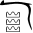

Éditer avec la souris est un processus simple, mais lent. En général, il sera utilisé conjointement avec l'un des deux autres modes d'édition.

## Positionner le curseur

Pour positionner le curseur, il suffit de cliquer dans la fenêtre d'édition principale.

## Insérer des signes avec les menus et la palette

La méthode la plus rapide d'insérer des signes est d'utiliser le clavier (voir la section "Édition au clavier"), et d'en saisir soit le code au format Manuel de Codage, soit la translittération. Toutefois, il est possible de sélectionner des signes depuis un menu ou depuis la palette des signes.

### Le bouton Signes

Le bouton Signes liste seulement les signes basiques, à partir des catégories Gardiner classiques (auxquelles s'ajoutent la catégorie Ff des signes issus du hiératique - cette catégorie étant utilisée dans la fonte Gardiner originelle). Le bouton Signes (labellé Hiéroglyphes de base) se trouve en bas à droite de la fenêtre de JSesh.

### La palette des signes

La palette des signes a été créée pour fournir une meilleure solution que le menu. Elle peut afficher tous les signes disponibles sans problème, et comporte des options de recherche avancée.

La palette des signes s’affiche ou s’efface en activant l’option Fenêtre > Hiéroglyphes.

L'utilisation basique de la palette est simple : sélectionner la famille de signes désirée (en utilisant la liste déroulante (b)), et double-cliquer dans le panneau (e) sur le signe que l'on souhaite insérer dans la fenêtre d'édition de JSesh.

Tous les signes ne sont pas affichés (par défaut, la palette n'affiche pas les variantes de signes). Pour afficher tous les signes d'une famille, cocher la case "show all" (h).
Cliquer sur un signe sélectionne celui-ci. Les informations au sujet de ce signe (son code, ses valeurs, etc.) apparaissent dans le panneau (i). Plus d'informations sont disponibles en sélectionnant l'onglet "Sign description" (a).

N.B. : La plupart des informations dans JSesh sont indiquées à des fins de recherche. En particulier, les détails concernant la signification des valeurs ne sont pas exhaustivement affichés. Ainsi, nous utilisons "bin" comme valeur pour G37, mais seulement parce qu'il s'agit d'un moyen mnémotechnique commode. En réalité, le format interne de JSesh permet de stocker davantage d'informations sur ce que sont les valeurs. Un autre exemple est Y1 ; pour ce signe, nous avons conservé le moyen mnémotechnique "sS", et ajouterons le probablement meilleur "sXA". Toute information plus scientifique sur le signe est du ressort de l'onglet "Sign Description" (qui est plutôt vide pour le moment).

#### Contrôles avancés

* **b** Le sélecteur de familles contient deux familles spéciales : "user palette" (palette utilisateur) et "last used signs" (derniers signes utilisés). Voir ci-dessous pour plus d'informations sur la palette utilisateur. "Last used signs" contient tous les signes utilisés par l'utilisateur au cours de la session. Ceci est sensé être utile si les mêmes signes apparaissent fréquemment.
* **c** Le contrôle "sub family" permet de restreindre la liste aux signes qui partagent certaines caractéristiques. Par exemple, si la famille "God" (dieux) est sélectionnée, la recherche peut être restreinte aux divinités à tête de faucon ("hawk-headed").
* **d** le filtre de translittération permet de rechercher des signes à partir de leur translittération. La translittération peut être la valeur phonétique d'un signe (pour les phonogrammes et les idéogrammes), ou peut être une valeur typique d'un mot entier ou d'un mot dans lequel le signe apparaît. Si la case "show all" est cochée, toutes les valeurs connus de JSesh seront utilisée (À COMPLÉTER).
* **f** Sélecteur de la palette utilisateur. Si cette case est cochée, le signe en cours de sélection sera ajouté à la palette utilisateur.
* **g** En cliquant sur le bouton "part of", Jsesh affichera tous les signes qui contiennent le signe en cours de sélection (du moins, s'il les connaît). À l'avenir, il pourrait utiliser la boîte "select all" pour choisir jusqu'à quel point aller. Chaque clic supplémentaire étendra l'ensemble des signes affichés (le suivant listera les parties, puis les parties de parties, etc.).
* **j** sélectionne des variantes connues du signe courant. Le terme "variante" est employé ici au sens large. Il peut désigner une réelle variante linguistique (ainsi Z7 est une variante de G43), tout comme il peut signifier "signes qui sont graphiquement basés sur un autre". Par exemple, A17A est une variante de A17 quant à sa signification, même si les utilisations linguistiques présentent quelque différence. Chaque clic supplémentaire étend l'ensemble, un second clic intégrant les variantes de variantes, etc.

#### La palette utilisateur

La palette utilisateur permet à tout utilisateur de composer sa propre liste de signes favoris. Ajouter un signe à la palette est simple : sélectionner le signe et cocher la case "user palette control" (f) dans la partie inférieure de la palette. Le contenu de la palette utilisateur est automatiquement sauvegardé, ce qui fait que la palette est disponible à chaque nouveau lancement de JSesh. Enlever un signe de la palette utilisateur est tout aussi simple : il suffit de sélectionner le signe concerné et de décocher la case "user palette control".

Tous les signes sélectionnés pour une inclusion dans la palette utilisateur sont affichés lorsque la famille spéciale "user palette" est sélectionnée.

#### Vous pouvez aider

Vous trouverez une description des fichiers utilisés par la palette dans un appendice à cette documentation. Si vous avez une bonne connaissance des hiéroglyphes, vous pouvez aider à améliorer JSesh en étendant les informations que la palette utilise. Pour plus de renseignements, envoyez un courriel à l'auteur (serge.rosmorduc AT qenherkhopeshef.org).

## Sélectionner une zone

La sélection se situe entre le curseur et ce qui appelé la marque. L'ensemble de la sélection est surlignée en bleu clair. Certaines opérations ne sont possibles que si une zone de texte est sélectionnée.

Il existe divers moyens de sélectionner une zone de texte :

* façon Mac : shift-clic à un endroit du texte : l'ensemble du texte entre cet endroit et le curseur sera sélectionné ;
* façon Unix : idem, mais en utilisant le clic-droit. Cela pourrait changer si je décide un jour d'utiliser les menus contextuels ;
* sélection au clavier : shift + flèche gauche ou droite pour déplacer l'étendue de la sélection ;
* cliquer-glisser à l'aide de la souris.

## Ajouter un signe sélectionné depuis un menu

Le menu du bouton **Hiéroglyphes de base** donne accès aux signes de la liste Gardiner standard. Sélectionner un signe l'ajoute à la position du curseur.

## Grouper des signes

Cela est fait à partir du menu "Text manipulation". Il est possible de grouper les signes en groupes verticaux ou horizontaux, en sélectionnant les signes (ou cadrats), puis en choisissant soit "group horizontal" soit "group vertical". N.B. : Il est possible de dégrouper les signes avec le menu "explode group". Tous les types de groupes peuvent ainsi être "explosés".

"Group Horizontal" a pour raccourci clavier "Ctrl-h".

"Group Vertical" a pour raccourci clavier "Ctrl-g".

## Ligatures

JSesh connaît un ensemble de groupes particuliers, ou ligatures, qui sont au-delà des capacités des cadrats. Par exemple, "w" et "t" seront le plus souvent disposés ainsi : . Pour réaliser une telle mise en forme, sélectionner les signes à ligaturer, et utiliser le menu Text manipulation/Ligature elements.

Toutefois, JSesh ne sait pas ligaturer tous les groupes, même s'il connaît quelques graphies sportives : ligaturer  donne .

### Ligatures complexes 

Certaines ligatures peuvent être considérées comme combinant un **signe** et un **groupe**.

Prenons par exemple le groupe . Il peut être interprété comme une ligature entre le signe ns et le groupe xAst:xAst:xAst. De telles ligatures peuvent être réalisées à l'aide du menu Text manipulation/Ligature group with hieroglyph ou Text manipulation/Ligature hieroglyph with group. Dans le premier cas, le groupe se situe  "à l'avant" du hiéroglyphe ; dans le second cas (qui correspond à notre exemple), le hiéroglyphe se trouve "à l'avant" du groupe.

Pour chaque signe, JSesh essaye de trouver deux zones. Une pour les ligatures "antérieures", une pour les ligatures "postérieures". Certains signes ont leur ligatures prédéfinies. Pour d'autres signes, celles-ci sont calculées automatiquement. En vérité, JSesh essaye de voir s'il peut adapter un rectangle dans la zone inférieure gauche des signes (pour l'orientation de gauche à droite). Cette zone serait la zone de départ. Pour la zone de fin, deux endroits sont examinés. Tout d'abord, le coin supérieur droit des signes (comme dans la ligature), et ensuite une large zone en bas à gauche, comme dans notre exemple.
Le créateur de signes peut fournir d'autres zones, ainsi : .

N.B. : Un signe peut être ligaturé simultanément avec le groupe qui le précède et celui qui le suit.

## Éditer des groupes

Lorsqu'il existe un groupe très spécifique, d'un type unique, dans lequel les signes doivent être disposés avec précision et d'une façon bien particulière, il est possible de sélectionner le menu Éditer le groupe. Le groupe édité sera soit le groupe sélectionné, s'il y a une sélection (surlignée en bleu clair), soit le dernier groupe avant le curseur, s'il n'y a aucune sélection.

Ce menu ouvre la fenêtre suivante :

Il sera alors possible de déplacer les signes, les mettre à l'échelle et les tourner. N.B. : Les mises à l'échelle et les rotations sont déclenchées par deux boutons. Pour déplacer un signe, il suffit de cliquer dessus et de le déplacer où l'on le veut. Pour le tourner ou le mettre à l'échelle, il suffit de cliquer-glisser l'une des petites cases rouges situées autour du signe en cours de sélection.