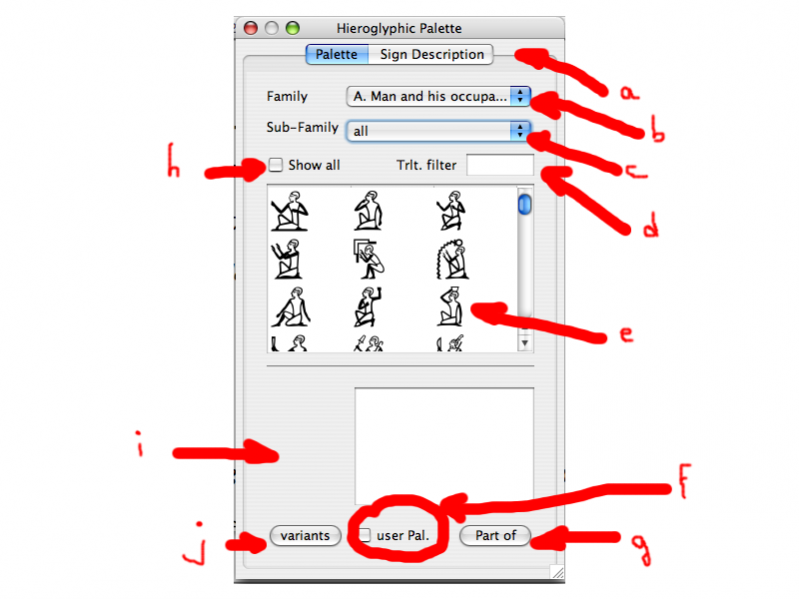
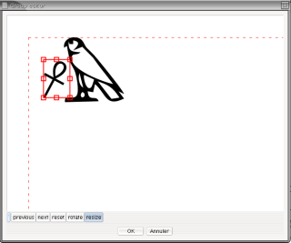

Editing with the mouse is a simple but slow process. Typically, it is combined with other editing methods.

## Setting the Cursor Position

To set the cursor position, click on the hieroglyphic panel where you want the cursor to be.

## Inserting Signs using Menus and palette

The fastest way to insert signs is by using the keyboard (refer to the section "Keyboard Editing") and typing either Manuel de Codage codes or transliterations. However, signs can also be selected from a menu or the sign palette.

### The Sign Button

The Sign button lists only the signs originally listed in Gardiner's grammar, including an additional "Ff" category for signs derived from hieratic script. This button is located at the bottom of the JSesh window.

### The Sign Palette

The sign palette was created to propose a better solution than the menu. It displays all available signs, and provides advanced search options.

To open the sign palette, use the menu `Tools/Hide Show Hieroglyphic Palette`.

The basic usage of the palette is quite simple: you select the family of signs you are interested in (using the dropdown list (b)), and then you double click on the sign you want to insert in the panel (e).

Not all signs are displayed (normally, the palette doesn't display variant signs). To display all signs from a family, check the "show all" box (h).
If you click only once on a sign, the sign will be selected.Information about the sign (its code, its values, etc.) will be displayed in the panel (i). More information will be available if you select the "Sign Description" tab (a).

Please note that most information in JSesh is here for searching purposes. In particular, details about what the values means are not fully displayed. For instance, we use "bin" as a value for G37, but only because it is a convenient mnemonic. In reality, the internal format of JSesh allows to store more information about what the values are. Another example is Y1; for this one, we will keep the "sS" mnemonic, and add the probably better "sXA". More scientific information on the sign will belong to the "Sign Description" (which is quite empty right now).

#### Advanced controls

b
: The "family selector" holds two special families: "user palette" and "last used signs". See below for more information on user palette. "Last used signs" contains all signs selected by the user in the palette during this session. It's supposed to be usefull if the same signs appears often.

c
: The "sub family" control allows to restrict the listing to the signs which share certain characteristics. For 
instance, if you have selected the "God" family, you can restrict the search to "hawk-headed" gods.

d
: the translitteration filter allows to look for signs using their translitteration. The translitteration used may be the phonetic value of a sign (for phonograms and ideograms), or may be a value typical of a word the sign appear in. If 
you check the "show all" box, all values known to JSesh will be used (TO BE COMPLETED).

f
: User palette selector. If you check this box, the currently selected sign will be added to the user palette.

g
: If you click on the "part of" button, Jsesh will display all signs that contain the currently selected sign (well, if he knows). in the future, it may use the "select all" box to choose how far to go. Each further click will extend the set of displayed signs (the next one will list parts, and parts of parts, etc.)

j
: select known variants of the current sign. The term "variant" is here used quite loosely. It may be real 
linguistic variants (as Z7 is a variant of G43, for instance), or it may means "signs which are graphically based on another one". For instance, A17A is a variant of A17 in this meaning, even if its linguistic uses are quite different. Each further click will extend the set. A second click would add variant of variants, etc...

#### User palette

The user palette allows a user to compose his own list of prefered signs. Adding a sign in the palette is simple: you simply select the sign, and check the "user palette control" (f) in the bottom part of the palette. The content of the user palette is automatically saved, so you will get your palette back next time you start JSesh. Removing a sign from the palette is as simple as selecting it and unchecking the "user palette" control.

All signs selected for inclusion in the user palette will be displayed when the "user palette" special family is selected.

#### You can help

You will find a description of the files used by the palette as an appendix to this documentation. If you have a good knowledge of hieroglyphs, you can help improving JSesh by extending the informations it uses. Mail the author (serge.rosmorduc AT qenherkhopeshef.org) for more information.

### Adding a sign chosen from a menu

The simplified hieroglyphs menu gives access to the signs of the standard Gardiner list. Simply select a sign, and it will be added at the cursor position.

You can access it by clicking on the  “basic hieroglyphs” button at the bottom of the JSesh window.

## Selecting a zone

The selection stands between the cursor, and what is called the mark. The whole selection is drawn in light blue. Some operations are possible only if a zone of text is selected.

To select a zone of text, you can use a number of ways :

* Mac style : shift-click on a point in the text ; the whole text between this point and the cursor will be selected ;
* Unix style : same, but using right-mouse button. This might change one day if I decide to use contextual menus.
* keyboard selection : shift + left or right arrow selects and move.
* mouse dragging

## Grouping signs

This is done using the "Text manipulation" menu. You can group signs into vertical or horizontal groups, by selecting the signs (or quadrants), and choosing either "group horizontal" or "group vertical". Note that you can break the groups with the menu "explode group". All kinds of groups can be "exploded".

"Group Horizontal" has the keyboard shortcut "Ctrl-h"

"Group Vertical" has the keyboard shortcut "Ctrl-g"

## Ligatures

JSesh knows a number of “special groups” , or ligatures, which are beyond the capabilities of "square" quadrants. For instance, "w" and "t" will likely be arrange like that: . To achieve such a layout, select the signs you want to ligature, and use the menu Text manipulation/Ligature elements.

However, JSesh doesn't know how to ligature all groups, even though it knows some rather "sportive" ones: ligaturing 
 gives .

### Complex ligatures

Some ligatures can be considered as the ligature of a sign and a group.

Let's consider the group  . It can be understood as a ligature between the sign F20 and the group xAst:xAst:xAst. Such ligatures can be built with the menus “Text manipulation/Ligature group with hieroglyph” or “Text manipulation/Ligature hieroglyph with group”. In the first case, the group is “in front”  of the hieroglyph, in the second case (which corresponds to our example), the hieroglyph stands “in front of” the group.

For each sign, JSesh tries to find two areas. One for "front" ligatures, and one for "back" ligatures. Some sign have their "ligature area" already set. For other signs, it is computed automatically. To tell the whole truth, JSesh tries to see if it can fit a rectangle in the bottom-left area of signs (for left-to-right orientation). This area would be the "start" area. For the "end" area, two places are examined. First, the top-right corner of the signs (like in the ligature, and then a large area in the bottom left, like in the case.
Signs creator can provide other areas, like in .

Please note that a sign can be ligatured at the same time with a group before it and with a group after it.

## Editing groups

When you meet a very specific group, one-of-a-kind type, in which you want to place the signs exactly where you want, you can select the edit group menu entry. The edited group will be either the selected group, if there is a selection (overlined in blue), or the last group before the cursor, if there is no selection.

It will open the following window :

You will be able to move the signs, to scale them, and to rotate them. Note that scaling and rotations are triggered by two buttons. To move a sign, click on it and drag it where you want. To rotate or scale it, click and drag one of the small red boxes around the currently selected sign.