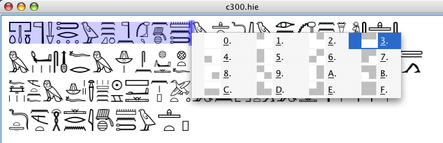
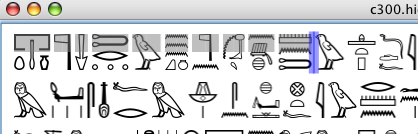
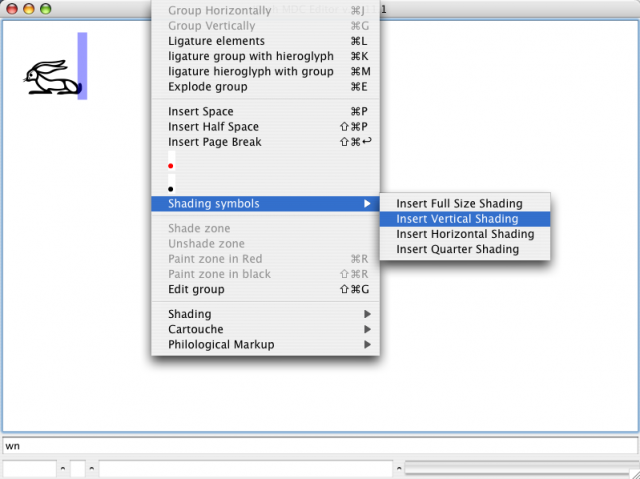
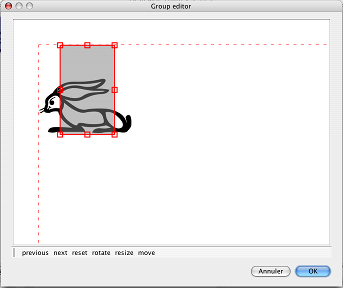

Shading/Hatching is currently a bit complex. The bad news is that it will become worse.

As an option (look at File/Document properties), shading can be either the classical "cross-line shading" you can see in old publications, or a light gray background. Although many users prefer the first one out of tradition, the second is indeed typographically superior. Cross-line shading makes signs difficult to read, which is not the case of the light gray background.

Shading comes in a number of flavors. This is due to the Manuel de Codage's history.

A good summary is available in the JSesh sample document (the one which used to appear when you started JSesh, and which is now included in the JSesh text library (in the next version, that is)).

But, to tell the whole story:

* Originally, there where two shading systems. The first one shaded a whole part of a text. It's the shading you get when you ask "shade zone". In JSesh, it works on the **selected text**.
* The second shading system used shading symbols, used exactly as hieroglyphs. In the original manual, cadrats where shaded by overwriting them with the corresponding shading symbols. You get them from the "shading symbol" menu entry. Thus,  can be obtained by typing "wn", then adding a shading symbol, and stacking both verticaly. JSesh understands this kind of shading since the beginning, but a menu to use is was only made available in version 2.10.
* then, around 1994, a new shading system was proposed, which covered most simple cases. It's the one you get with the "Shading" menu. It applies to the current group (the group in front of the cursor), and can be used to shade any quarter of a group.
* MacScribe is able to shade quarter of individual signs. In MacScribe, "`p##13*p:pt`" would have the "p" sign half shaded. A variant of this system is understood by JSesh. The external [MacScribe converter](https://jsesh.qenherkhopeshef.org/software/MacScribeImporter.zip) software understands this.
* A "free" shading system would be nice too. In this case, the outline of the shaded zone would be freely drawn. I plan to add it too (taking advantage of the group editor). But currently, if you need to be that precise, the only option JSesh gives you is to export your file in some convenient format (for instance SVG) and to modify it there.

## Shading part of a quadrat

The menu entry in Text Manipulation/Shading can apply to a selection. That is, you can shade the top part of all groups in a selection in one operation (previously, you had to shade each group individually).

For people who type texts with lots of lacunas, I have added a popup menu. If you press the "#" key on your keyboard, this menu will appear. You can navigate in it with the keyboard or select entries by a specific letter.

Here is an example. I have selected a part of the text and pressed "#". The popup pops up.

Now I can select the shading I need by various means (it depends on your computer system). For instance, I can type "3", move in the menu with the keyboard arrows or select the menu item with the mouse. Then, the whole selected text is shaded:

## Current options to do some tricky shading

If you want, for instance, to add a shaded zone over the middle of a sign, you can now do it. In fact, it's the reason why I added a menu to retrieve the "old" shading symbols.

Let's say you want to create . You first need to enter both signs. The shading is added through the menus :

Then, you simply need to use the group editor:

You should probably enter the shading symbol first, and then the glyph. This way, if your final output format doesn't understand transparency, you will still have a correct rendering.

(By the way, ecdotic marks like `[ ... ]` are also glyphs. As such, they can be moved in the group editor).