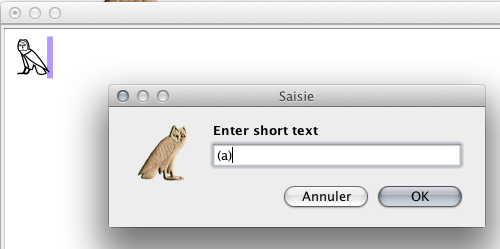
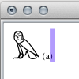

Il est assez usuel d'ajouter de courtes annotations, comme « tr », « sic »  ou des appels de notes de bas de page, comme « (a) » , dans les textes hiéroglyphiques. Pour réaliser cela dans JSesh, utilisez le menu `Insérer/texte court`.

Le texte que vous tapez se comportera alors comme un signe hiéroglyphique. Il aura une certaine taille, mais il pourra faire partie d'une ligature ou d'un groupe, ce qui vous permet d'éviter de perturber la disposition des autres signes.

Exemple :

Supposons que je veuille ajouter "(a)" après un signe G17. J'utilise `Insérer/texte court`, puis je tape le texte approprié.

Mais le texte apparaît après le signe :

Je sélectionne à la fois le hiéroglyphe et le texte, et j'utilise `Manipulation de Groupe/Ligaturer hiéroglyphe et groupe`. Et j'obtiens :

Vous pouvez aussi utiliser `Éditer le groupe` :

