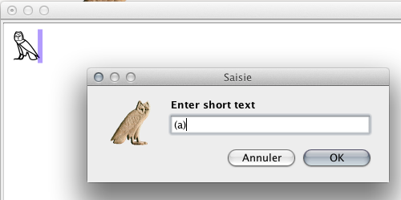
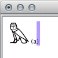
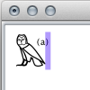
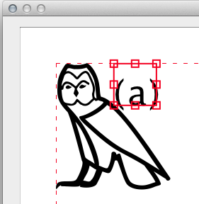

È abbastanza comune aggiungere piccole annotazioni, come "tr" o "sic", o riferimenti a note a piè di pagina, come "(a)", nei testi geroglifici. Per farlo in JSesh, usa la voce di menu `Inserisci/testo breve`.

Ora, il testo che digiti si comporterà esattamente come un segno geroglifico. Avrà una certa dimensione,
ma può far parte di una legatura o di un gruppo, il che ti permette di evitare di interferire con la disposizione degli altri segni.

Esempio:

Supponiamo di voler aggiungere "(a)" dopo un segno G17. Utilizzo "Modifica/Inserisci testo breve" e digito il testo corretto.

Ma il testo appare dopo il simbolo:

Seleziono sia il geroglifico che il testo e uso "Gruppo/Legatura geroglifico e gruppo". Ed ecco fatto:

In alternativa, puoi usare "Gruppo/Modifica gruppo":

