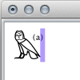

It's quite usual to add small remarks, like "tr" or "sic", or footnote references, like "(a)", in hieroglyphic texts. To do this in JSesh, use the menu entry "Edit/insert short text".

Now, the text you type will behave just like a hieroglyphic sign. It will have a certain size, 
but it can be part of a ligature or a group, which allows you to avoid disturbing the other signs layout.

Example:

Suppose I want to add "(a)" after a G17 sign. I use "Edit/Insert Short Text", and they I type the correct text.

But the text appears after the sign:

I select both the hieroglyph and the text, and I use "Group/Ligature hieroglyph and group". And voilà:

Alternatively, you may use "Group/Edit Group":

