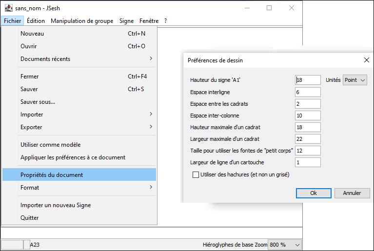

JSesh vous permet de définir plusieurs options quant à l'apparence finale des documents. Vous pouvez ainsi modifier l'espacement des lignes, la taille des signes, etc.

Depuis JSesh 5, la plupart des informations concernant le rendu sont sauvegardées avec chaque document. Les changer modifiera seulement le texte en cours d'édition.

## Préférences de dessin

Les paramètres de préférences pour les dessins sont accessibles à partir du menu **Fichier > Propriétés du document** :

## Préférences d'exportation 

Les paramètres de préférences pour les formats d’exportation des graphiques sont accessibles à partir du menu **Édition > Préférences**.

Voir le chapitre suivant qui leur est consacré.