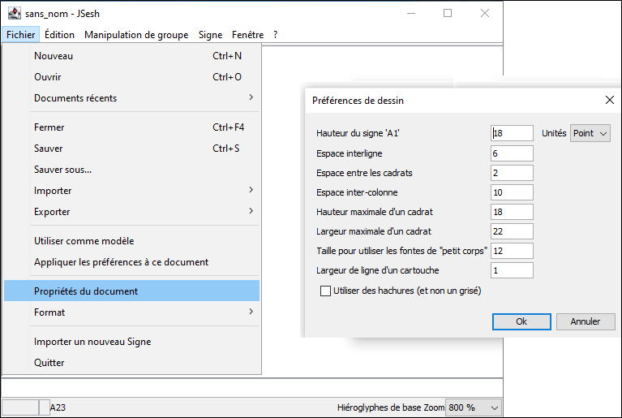

JSesh allows you to make a number of choices about the way the document will be displayed. You can change line spacing, sign sizes, and so on. 
From JSesh 5 onward, most display information are saved with each document. Changing them will only modify the currently edited text. 

## Document preference

## New document preferences

