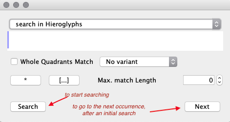
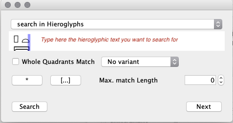
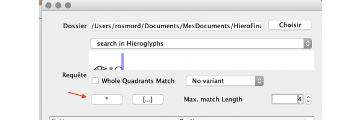
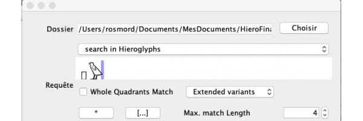
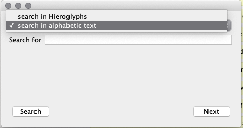
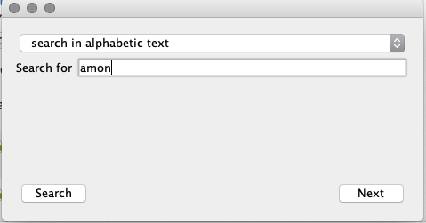
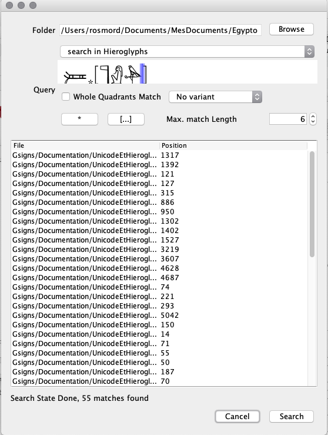

Dalla versione 7.2 di JSesh, è possibile effettuare ricerche nei documenti JSesh (era ora!).

È possibile effettuare ricerche nel documento *corrente* o in tutti i documenti JSesh contenuti in una determinata cartella.

## Ricerca nel documento corrente

Per effettuare una ricerca nel documento corrente, è possibile utilizzare le voci di menu:

- **Modifica/Trova** per aprire la finestra di dialogo "Trova"
- **Modifica/Trova successivo** per cercare l'occorrenza successiva di una ricerca.

Devi quindi descrivere cosa vuoi cercare. JSesh è piuttosto potente in questo caso. Puoi
cercare sia testo geroglifico che non geroglifico.

## Ricerca di testo geroglifico

Cercare testo geroglifico può essere abbastanza semplice. Digita il testo che stai cercando nel campo di ricerca (vedi immagine sotto) e premi il pulsante "Cerca".

Per impostazione predefinita, la ricerca cercherà *sequenze* di segni, indipendentemente dal loro layout. Se si desidera cercare
un layout specifico, selezionare la casella **Corrispondenza intero quadrate**.

## Ricerca avanzata per testo geroglifico

Noterete dei pulsanti numerici sotto il campo di testo. Consentono di includere maggiore variabilità nel testo che state cercando.

### Il carattere jolly `*`

Il pulsante `*` consente di cercare sequenze di segni non strettamente consecutivi. Ad esempio, ir`*`t cercherà sequenze di segni contenenti ir`, quindi eventualmente un certo numero di altri segni, quindi t.

Poiché la ricerca troverà qualsiasi sequenza di caratteri corrispondente, *indipendentemente dalla sua lunghezza*, potresti ottenere risultati inaspettati, come la corrispondenza con ir nella seconda riga del testo e con una t nella cinquantesima. Per evitare questo problema, puoi limitare la lunghezza del risultato atteso. Ad esempio, se desideri consentire al massimo due caratteri tra ir e t, puoi limitare la lunghezza del risultato a quattro caratteri, come nell'esempio precedente, utilizzando il campo **Lunghezza massima della corrispondenza**.

Una stringa di ricerca può contenere più "*", se lo desideri.

Se **Lunghezza massima della corrispondenza** è 0, verrà interpretato come "nessun limite".

**Nota:** il carattere jolly "*" non ha nulla a che fare con il codice *Manuel de Codage* "*" per il raggruppamento dei caratteri.
### Il pulsante `[...]`

Questi pulsanti consentono di introdurre varianti nei segni che si desidera trovare. Il sistema cercherà **uno** qualsiasi dei segni compresi tra [...].

Ad esempio, "p[W-w]" cercherà sia p-W che p-w.

### Varianti nelle ricerche

Se selezioni "Varianti estese", il risultato della ricerca includerà testi che contengono **qualsiasi** variante dei tuoi segni **come registrati in JSesh.**

Poiché W e w sono considerate varianti, la ricerca seguente troverà occorrenze sia di p-W che di p-w.

Rispetto all'uso di [...], questo sistema è meno preciso; [...] consente di specificare esattamente ciò che si sta cercando. In alcuni casi potrebbe essere più esaustivo. Tuttavia, dipende dalla qualità delle descrizioni dei segni JSesh. Le informazioni attuali sulle varianti sono ancora molto lacunose: le descrizioni dei segni richiedono molto lavoro.

Verranno utilizzate varianti di qualsiasi tipo, sia registrate che di varianti. Si prevede che in futuro verrà implementato un sistema più preciso.

## Ricerca in testi non geroglifici

La ricerca non è più limitata ai geroglifici. Se hai digitato traduzioni o traslitterazioni, puoi effettuare la ricerca anche in questi...

Seleziona **Cerca in testi alfabetici**...

Quindi digita il testo (la ricerca ignorerà le maiuscole e le minuscole):

## Ricerca nelle cartelle

Questa è una funzionalità molto potente di JSesh: può cercare in tutti i file di glifi contenuti in una cartella (e nelle sue sottocartelle). In un certo senso, puoi usare i tuoi testi (incluse le traduzioni digitate in JSesh) come una sorta di database linguistico approssimativo.

Per utilizzare questa funzione, usa il menu **Modifica/Trova nella cartella**. Quindi seleziona la cartella "radice" per la tua ricerca.
Nell'esempio seguente, sto cercando l'attestazione di Atum, usando un carattere jolly piuttosto generico. Nota l'uso di [...] per includere segni varianti (alcuni possibili determinativi mancano tuttavia in questa ricerca, lascio la parola al lettore interessato come esercizio). Nota anche la lunghezza che ho impostato per limitare i risultati *falsi positivi*. Ricorda che questa lunghezza include l'intero risultato, non solo la parte saltata dal simbolo "*".

Una volta avviata la ricerca, le occorrenze appariranno nell'elenco sotto il modulo di ricerca. **Fare doppio clic su un'occorrenza aprirà il documento corrispondente.**

