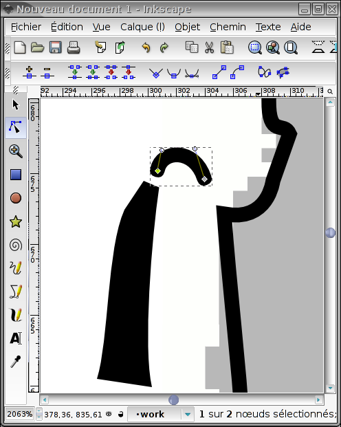
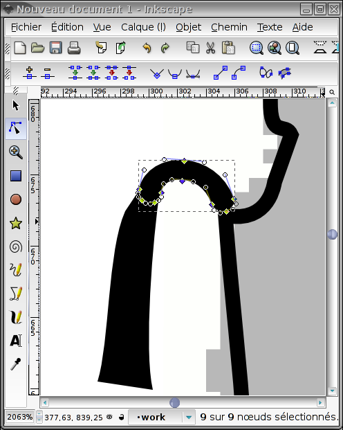
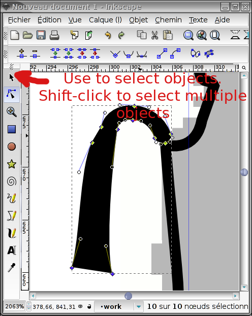
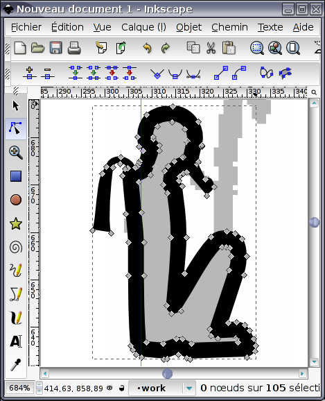

## Introduzione

JSesh non include ancora un editor di geroglifici. Tuttavia, può includere segni disegnati con diversi altri software, come Fontforge e Inkscape. Anche se viene aggiunto un editor di segni, questa funzionalità verrà mantenuta.

In questo tutorial, mostro come utilizzare il software Inkscape per creare un nuovo geroglifico.

Disegnare un nuovo segno è un compito piuttosto lungo e noioso. Richiede una conoscenza di base della grafica vettoriale (Inkscape, Adobe Illustrator...), il che non è banale, e richiede comunque molto lavoro. Non solo è importante disegnare bei segni, ma questi segni devono anche fondersi con gli altri font.

## Alcune nozioni sul disegno vettoriale

Disegnare immagini vettoriali richiede una certa comprensione di cosa si tratta. Ne parleremo più avanti (a meno che qualche anima gentile non possa contribuire con un bel tutorial gratuito).

Requisiti per i segni utilizzabili con JSesh: i segni devono essere disegnati come contorni neri su sfondo bianco. Il modulo di importazione JSesh può leggere contorni non riempiti, ma l'importazione darà risultati migliori con contorni riempiti con larghezza zero. Inkscape è in grado di convertire le curve in contorni, quindi non è un requisito particolarmente gravoso.

## Creazione di un'immagine di sfondo

Puoi iniziare scattando un'immagine del glifo che vuoi creare. Questa immagine potrebbe essere un disegno a tratteggio o una fotografia di un glifo reale. Vuoi che le linee nere del tuo simbolo siano leggibili, quindi cambia i colori se necessario (ad esempio, se hai un disegno a tratteggio del simbolo, coloralo in grigio chiaro).

Il nostro esempio sarà un rendering a bassa risoluzione del simbolo C102 (Ptah seduto con le wꜣ) dalla stele israeliana. La bitmap originale è . Con un programma di disegno, abbiamo attenuato l'immagine per ottenere .

## Disegna il contorno

Ora avviamo Inkscape e importiamo il disegno bitmap. Creiamo un nuovo livello e chiamiamolo "lavoro". In questo modo, non altereremo il disegno bitmap.
Disegneremo quindi un contorno approssimativo della forma del simbolo. Dato che non siamo dei grandi disegnatori, usiamo lo strumento "Curva di Bézier". Otteniamo il seguente risultato:

Nota che abbiamo selezionato "nessun riempimento" e una larghezza del contorno ridotta. Abbiamo anche lasciato invariato il segno "Was".

## Adatta il contorno

I segmenti di linea retta non saranno un buon segno. Quindi ne convertiamo alcuni in curve, aggiungiamo nuovi punti se necessario, ecc...
Iniziamo con la testa...

Ecco il risultato:

## Lavorare sui dettagli

Vogliamo che i nostri segni siano leggibili anche a piccole dimensioni, quindi non riempiremo troppi dettagli.

## La barba di Ptah

Il contorno del corpo di Ptah verrà ingrandito per creare il segno finale. Ma vorremmo che la barba fosse riempita (in questo caso, abbiamo dato a Ptah una barba osiriana, il che è un errore). Pertanto, dobbiamo separarla dal resto del disegno. Questo si fa selezionando i punti di controllo che separano la barba dal corpo:

Quindi selezioniamo la voce "Spezza" nel menu "Tracciato", che ci fornisce due oggetti: la barba e il resto del corpo.
Possiamo quindi riempire lo spazio appena creato (e dare a Ptah un mento) :-).

Ora, anche la barba dovrebbe essere chiusa. Modifichiamo le caratteristiche di riempimento e contorno della barba, assegnandole un riempimento nero pieno e nessun contorno. Se la barba è troppo sottile, potremo dilatarla con l'azione "Inizio" del menu Tracciato.

## Contrappeso della collana di Ptah

Per questo, la scansione originale è un po' approssimativa. Abbiamo approfondito un po' l'iconografia e abbiamo ottenuto un contrappeso per collana in due parti.

La collana è composta da due parti: un filo e il contrappeso stesso. Il filo è un semplice tratto curvo, mentre il contrappeso è un tracciato pieno.

Vogliamo unirli in un unico oggetto, che sarà un tracciato pieno. Per farlo, convertiamo prima il filo in un tratto.

Selezioniamo quindi le due parti della collana e utilizziamo l'operatore "unione" nel menu "tracciato".

## Scegliere la giusta larghezza di linea

A questo punto, potresti voler salvare il tuo lavoro due volte. Una come backup e una, ovviamente, come file di lavoro. Ora, seleziona il disegno principale e scegli una larghezza di linea ragionevole. Dovrebbe integrarsi bene con il resto dei font. Potrebbe essere interessante ridurre lo zoom per vedere il segno così come verrà visualizzato.

## Unire tutto

Ora, assicurati che tutti i tratti siano trasformati in tracciato e usa l'operatore di unione su di essi. Dovresti ottenere:

Ti consiglio vivamente di conservare una versione di backup del tuo simbolo in cui i tratti non siano trasformati in tracciati, ti permetterà di rielaborarlo più facilmente o di riutilizzarlo come parte di altri cartelli. Questo è ciò che faccio io per i miei font Ramesside.

## Aggiunta di altri dettagli

Utilizzando le stesse tecniche, otteniamo il risultato finale:

che salviamo con il nome `C102.svg`.

## Commenti finali

Da un'immagine a bassa risoluzione, possiamo ottenere un glifo dall'aspetto gradevole. Ricorda che il simbolo sarà piuttosto piccolo e non aggiungere troppi dettagli (dare la possibilità di aumentare i dettagli del simbolo con le sue dimensioni è un'opzione interessante, utilizzata nei font Gardiner's Lead). Cerca di mescolare con i cartelli esistenti. Infatti, se hai sorgenti SVG per cartelli simili, prova a riutilizzarle.

Il segno fornito in questo esempio non è un esempio calzante. La "Wꜣs", per esempio, è troppo alta e il segno non si integra bene con i font esistenti. Quindi dovremmo accorciare lo scettro. In generale, il nostro Ptah è troppo scarno rispetto agli altri segni. Mantenere le fasi intermedie del tuo lavoro ti permetterà di correggere più facilmente. Ad esempio, se i tratti sono troppo spessi, se hai mantenuto una versione del segno in cui i tratti sono ancora tratti e non sono ancora stati sostituiti da tracciati, la correzione è molto semplice.
