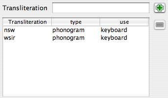

È possibile documentare i geroglifici (e in particolare i nuovi simboli) in modo che la palette possa gestirli in modo migliore. Questo è ovviamente utile per i nuovi simboli creati, ma anche per i simboli "standard" di JSesh, poiché le informazioni sui simboli fornite da JSesh sono attualmente molto parziali. Il contributo degli utenti, soprattutto dei professionisti, sarebbe molto gradito.
La caratteristica principale della versione 2.4.15 di JSesh è la disponibilità di un editor intuitivo per aggiungere informazioni sui simboli.

## Avvio dell'editor di descrizione dei simboli

L'editor di descrizione dei simboli è un programma separato. Per avviarlo:

* su Windows, esiste una scorciatoia
* su Linux, dovrebbe essercene una anche
* su Mac, vai alla cartella di installazione di JSesh. Troverai l'editor nella cartella "bin". Si chiama signInfoEditor.command.

Tieni presente che puoi provare e provare l'editor a piacimento, purché non salvi nulla. Quando salvi, il risultato verrà utilizzato la prossima volta che avvierai JSesh.

## Modifica delle descrizioni dei simboli

I simboli sono definiti dalle seguenti informazioni:

* Le traslitterazioni associate al simbolo
* I simboli che ne fanno parte. Ad esempio, A6 contiene un simbolo W54
* Il/I simbolo/i di cui sono varianti
* Descrizioni in testo libero del simbolo, che possono includere ad esempio note bibliografiche
* I tag sono brevi elementi descrittivi associati ai simboli e utilizzati per selezionarli. Ad esempio, "nemico" è associato ai simboli che rappresentano un nemico.

Quando si avvia l'editor delle descrizioni dei simboli, vengono automaticamente lette le descrizioni standard dei simboli e le proprie descrizioni. È quindi possibile aggiungere o modificare i dati e salvare il risultato (semplicemente selezionando "Salva" nel menu). Si noti che l'editor impedirà di modificare le informazioni memorizzate nelle descrizioni dei simboli di sistema.

Una caratteristica importante dell'editor è la possibilità di utilizzare la tavolozza dei simboli (dal menu degli strumenti) per selezionare i simboli.

## La finestra principale dell'editor delle informazioni sui simboli

La finestra principale dell'editor delle informazioni sui simboli consente di modificare le informazioni su un determinato simbolo. La selezione del simbolo su cui si desidera lavorare può essere effettuata in diversi modi. È possibile navigare con le frecce nella parte inferiore della finestra, digitare il codice del simbolo nel campo "Codice" o semplicemente trascinare e rilasciare il simbolo dalla tavolozza. Una volta visualizzato un simbolo, è possibile aggiungere informazioni al riguardo.

La casella di controllo "Segno di base" viene utilizzata per specificare che il simbolo deve essere visualizzato nella tavolozza dei simboli anche se "mostra tutto" non è selezionato.

Da questa finestra è possibile modificare le traslitterazioni dei simboli e molte altre cose. La parte inferiore della finestra dà accesso a tre tipi di informazioni: relazioni tra questo simbolo e altri simboli, descrizione del simbolo in testo libero e tag.

## Traslitterazione

È possibile associare diverse traslitterazioni a un determinato simbolo. Le traslitterazioni possono essere utilizzate in vari contesti: per trovare un segno (nella tavolozza o digitando la traslitterazione direttamente sulla tastiera), o semplicemente a scopo informativo, per traslitterazioni non comuni.

### L'Editor di Traslitterazione

Per digitare una nuova traslitterazione, è sufficiente premere il pulsante "+". Se si inserisce del testo nel campo di testo della traslitterazione, questo testo verrà utilizzato come nuova traslitterazione.

Se si desidera eliminare una propria traslitterazione, selezionare la riga e premere il pulsante "meno". Questo pulsante è grigio se non è selezionata alcuna riga o se la riga selezionata non può essere eliminata.
È quindi possibile correggere i valori "tipo" e "uso".

Non sono sicuro che il valore "tipo" sia utile o meno, e al momento non è utilizzato da JSesh. La colonna "uso" è, d'altra parte, piuttosto importante.

Il valore "uso" spiega in quale contesto questa traslitterazione viene utilizzata nel software. Si noti che ogni livello di utilizzo è incluso nel successivo. Ad esempio, se si sceglie "tastiera", il simbolo verrà utilizzato anche nei contesti "tavolozza" e "informativo".

#### Tipi

* fonogramma:
* ideogramma: dovrebbe essere usato sia per gli ideogrammi semplici (quelli seguiti da Z1), sia per i cosiddetti determinativi fonetici, che in realtà sono ideogrammi camuffati.
* abbreviazione: da usare per i segni che sono vere e proprie abbreviazioni di parole. Normalmente non sono seguiti da Z1 nella scrittura. Esempio: G37 può essere usato come abbreviazione di "Sri".
* tipico: il segno è tipico di una parola. Spesso utile per alcuni determinativi. Io lo uso per il valore "bin" di G37.
* tastiera: il segno sarà accessibile tramite questa traslitterazione in JSesh quando si utilizza la tastiera per inserire i segni. Ad esempio, la traslitterazione "iw" di D54.
* tavolozza: il segno non sarà accessibile dalla tastiera tramite questa traslitterazione, ma sarà accessibile tramite la tavolozza. Si noti che se un utente utilizza la traslitterazione per accedere a un segno nella tavolozza, potrà accedervi in ​​seguito tramite la sua traslitterazione.
* informativo: la traslitterazione è fornita solo a scopo informativo. Apparirà nel campo "valore" della tavolozza, ma questo è tutto.

## Editor *Parte del simbolo*

L'editor *Parte del simbolo* permette di descrivere gli elementi di un simbolo in termini di altri simboli. Ad esempio, il re dell'Alto Egitto, figura A44, indossa una corona bianca, regge uno scettro nekhakha e indossa anche un ureo. Tutti questi, a loro volta, sono geroglifici. Si noti che non è necessario elencare tutte le parti. Ad esempio, se un dio indossa la corona Atef, che a sua volta contiene la Piuma di Maat, non elencare la piuma. È già indicata come parte dell'Atef (grazie a J. Hallof per questa osservazione alla conferenza di Oxford del 2006).

## Editor di varianti

Il concetto di variante è complesso. In realtà, non è così ben definito e, peggio ancora, il suo significato utile può dipendere dal contesto. Esistono infatti due nozioni. Una è grafica. Una **variante grafica** di un simbolo è un simbolo che **assomiglia** a un altro. Un'altra nozione è linguistica. Un simbolo è una **variante linguistica** di un altro se ha gli **stessi valori e usi**. Le due nozioni spesso si sovrappongono, ma non sempre. Ad esempio, Y2 è sia una variante grafica di Y1, sia una sua variante linguistica. D'altra parte, `A17A` A17A è solo una variante grafica di A17 A17. Non ha affatto gli stessi usi; Z7 Z7 e G43 G43 sono varianti linguistiche, ma non varianti grafiche.

Queste nozioni saranno utilizzate da JSesh sia per la palette dei simboli (con il suo pulsante "variante di") sia per il sistema di ricerca. Potrebbe essere utile, durante la ricerca di parole con G43, recuperare quelle con Z7.

* è simile: viene selezionato se i segni "sembrano uguali".
* grado: indica quanto è stretta la relazione tra i due segni. Può essere:
* completo: una variante completa di un segno S è un segno con gli stessi usi e valori di S.
* parziale: gli usi si sovrappongono in modo significativo. Di solito, la variante coprirebbe alcuni degli usi del segno originale.
* altro: altri tipi di varianti. Ad esempio, D36 (il braccio) può essere considerato una variante di D37 (il segno "rdi"), in alcuni contesti, ma i due segni hanno un'identità molto distinta.
* no: il segno non è affatto una variante linguistica.
* non specificato: non lo sai veramente, o non hai tempo di farlo.

## Editor di descrizione

Questo campo consente commenti a testo libero per i simboli. L'uso più importante è documentare simboli non comuni, fornendo riferimenti bibliografici e, in generale, aiutando l'utente a selezionare il segnale migliore. Se si desidera che la descrizione del segnale venga inclusa nella versione distribuita di JSesh, è necessario che siano presenti riferimenti bibliografici a supporto. Si noti inoltre che JSesh è un software libero, ma che deve rispettare il copyright. Pertanto, questo non è il luogo per la copia anonima degli elenchi di simboli delle grammatiche più comuni (ciò non significa, ovviamente, che non si possano utilizzare come fonti). È possibile scrivere descrizioni in più lingue, anche se sarebbe preferibile disporre di una versione in inglese per ciascun segnale. JSesh stesso, tuttavia, attualmente utilizza solo la versione in inglese.

## Editor elenco tag

Questa finestra consente di descrivere il simbolo in termini di varie parole descrittive brevi chiamate "tag". Questi sono disponibili nella palette per selezionare sottocategorie di una determinata famiglia. Ad esempio, i caratteri "in piedi" (ovviamente, i tag utilizzati qui non si applicano ad A44). La finestra di sinistra mostra tutti i tag disponibili, elencando prima quelli già utilizzati per questa famiglia e poi gli altri tag. Il modo migliore per taggare i simboli è guardare simboli simili e vedere come si fa.

Vorrei attirare la vostra attenzione su alcuni tag molto utili, che sono leggermente diversi. Si tratta di "simbolo alto e stretto", "simbolo basso e largo" e "simbolo lungo e stretto". Questi tag sono utilizzati come famiglie speciali nella palette JSesh.

Per aggiungere un nuovo tag a un simbolo, è sufficiente selezionarlo nell'elenco di sinistra e fare clic sulla freccia da sinistra a destra. Per rimuovere un tag, utilizzare lo stesso principio. Tieni presente che non puoi rimuovere i tag forniti nell'elenco "ufficiale" di JSesh.

v## La finestra di creazione dei tag

Questa finestra (accessibile tramite il menu Strumenti) consente di creare nuovi tag e di associarvi traduzioni multilingue. Tali traduzioni non sono attualmente utilizzate.

## I menu

### File

* Apri file predefinito utente: apre il file contenente le definizioni personalizzate per i segnali. Queste verranno utilizzate automaticamente da JSesh al successivo avvio.
* Salva: salva il lavoro nel file di definizione utente. Finché non è stato completato, il file non viene modificato.
* Cancella: crea un nuovo spazio di lavoro, senza dati al suo interno, ad eccezione di quello "ufficiale". Il file utente verrà comunque modificato solo se si salva il lavoro.

### Modifica

* Copia: copia la definizione di questo segnale per un utilizzo futuro
* Incolla: incolla i dati copiati per un altro segnale in questa definizione. Molto utile quando si gestiscono varianti simili.

### Strumenti

* Mostra/Nascondi Palette: consente di aprire la palette dei simboli, per selezionarli (tramite trascinamento).
* Visualizza Editor Tag: apre (o chiude) la finestra dell'editor dei tag, per creare nuovi tag.

## Contribuire alla descrizione del tuo simbolo in JSesh

Le descrizioni dei tuoi simboli sono memorizzate in un file chiamato `signs_definition.xml`, che si trova in:

* `(La tua directory home)/Libreria/Preferenze/JSesh` su Macintosh. Ad esempio: `/Utenti/rosmord/Libreria/Preferenze/JSesh/signs_definition.xml` sul mio computer.
* `c:\Documents and Settings\TUO LOGIN\JSeshData` su Windows (in pratica, JSeshData nella tua cartella personale). Normalmente, la directory JSeshData viene creata da JSesh, quindi puoi cercarla in caso di dubbi. Ad esempio, `C:\Documents and Settings\Rosmord\JSeshData`.
* `$HOME/.jsesh` su Linux.

Per contribuire con le descrizioni dei segnali a JSesh, inviami semplicemente questo file. Deciderò cosa includere nella distribuzione generale di JSesh. Ci sono molti problemi di cui devo tenere conto: il software deve rimanere sufficientemente generico, sufficientemente corretto e devo evitare violazioni del copyright.
