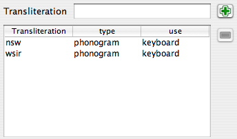

It is possible to document the hieroglyphs (and in particular the new signs) so that the palette can handle them in better ways. This is of course useful for your own new signs, but also for "standard" JSesh signs, as the signs information provided by JSesh is currently very partial. User input would be most welcome here, and above all user input by professionals.
The main feature of version 2.4.15 of JSesh is the availability of a user friendly editor for adding information about signs. 

## Starting the sign description editor

The sign description editor is a separate program. To start it:

* on windows, there is a shortcut for it
* on linux, there should be one too
* on mac, go to your JSesh installation folder. You will find the editor in the "bin" folder. It's called signInfoEditor.command.

Please note that you can play and test the editor at will, as long as you don't save anything. When you save, the result will be used the next time you start JSesh.

## Editing the sign descriptions

The signs are defined by the following information:

* The Transliterations associated with the sign
* The signs which are part of this sign. For instance, A6 contains a W54 sign
* The sign(s) of which they are variants
* Descriptions in free text of the sign, which may include for instance bibliographical remarks
* Tags are short description items attached to the signs, and used to select them. For instance, "enemy" is attached to signs which represent an ennemy.

When you start the sign description editor, it automatically read the standard sign descriptions as well as your own descriptions. You can then add or change data, and save the result (simply by choosing "save" in the menu). Note that the editor will prevent you from changing the information which is stored in the system sign descriptions.

An important feature of the editor is that you can use the sign palette (from the tool menu) to select signs.

## The Main Sign Info Editor Window

The sign info editor main windows allows one to edit information on a given sign. Selecting the sign you want to work on can be done in many ways. You can navigate with the arrows on the bottom of the window, type the sign code in the "Code" field, or simply drag and drop the sign from the palette. Once a sign appear, you can add information about it.

The "basic sign" check box is used to say that the sign should appear in the sign palette even if "show all" is not selected.

From this window, you can edit the sign transliterations, and many other things. The bottom part of the window gives access to three kinds of information: relationships between this sign and other signs, free text description of the sign, and tags. 

## Transliteration

It is possible to associate a number of transliterations with a given sign. Transliterations can be used in various contexts: to find a sign (in the palette, or typing the transliteration directly at the keyboard), or simply for informative purposes, for uncommon transliterations.

### The Transliteration Editor

To type a new transliteration, simply press the "+" button. If you enter some text in the transliteration text field, this text will be used as the new transliteration.

If you want to suppress a transliteration of yours, select the line, and press the "minus" button. This button is gray if no line is selected, or if the selected line can't be deleted.
You can then fix the "type" and "use" values.

I'm not sure whether or not the "type" is useful, and it's currently not used by JSesh. The "use" column is, on the other hand, quite important.

The "use" explain in which context this transliteration is used in the software. Note that each level of use in included in the next one. For instance, if you chose "keyboard", the sign will be also used in "palette" and "informative" contexts.

#### Types 

* phonogram:
* ideogram: should be used both for simple ideograms (those followed by Z1), and for so-called phonetic determinatives, which are really ideograms in disguise.
* abbreviation: use for signs which are actual abbreviations for words. They are not normally followed by Z1 in writing. Exempli gratia: G37 can be used as abbreviation for "Sri".
* typical: the sign is typical for some word. Often useful for some determinatives. I use it for G37's value "bin".
* keyboard: the sign will be accessible through this transliteration in JSesh when using the keyboard to enter signs. For instance, D54's transliteration "iw".
* palette: the sign will not be accessible from the keyboard through this tranliteration, but will be accessible through the palette. Note that if a user uses transliteration to access a sign in the palette, he will be able to access it through its transliteration afterwards.
* informative: the transliteration is given only for informative purposes. It will appear in the "value" field of the palette, but that's all.

## *Part of sign* editor

The *part of sign* editor allows to describe the elements of a sign in terms of other signs. For instance, the king of Upper Egypt figure A44 wears a white crown, holds a nekhakha scepter, and wears also an uraeus. All of those, in turn, are hieroglyphs. Note that you don't need to list all parts. For instance, if a god wears the Atef crown, which in turn contains the Maat Feather, don't list the feather. It's already given as a part of the Atef (thanks to J. Hallof for this remark at the Oxford 2006 conference).

## Variant editor

The notion of variant is a tricky one. In fact, it's not that well defined, and, worse, its useful meaning may depend on the context. There are in fact two notions. One is graphical. A **graphical variant** of a sign is a sign which **looks like** another one. Another notion is linguistic. A sign is a **linguistic variant** of another one if it has the **same values and uses**. The two notions often overlap, but not always. For instance, Y2 is both a graphical variation of Y1, and a linguistic variant thereof. On the other hand, `A17A` A17A is only a graphical variant of A17 A17. It doesn't have the same uses at all;  Z7 Z7 and G43 G43 are linguistic variants, but not graphical variant at all.

These notions will be used by JSesh both for the sign palette (with its "variant of " button) and for the search system. It may be usefull, while searching for words with G43, to retrieve those with Z7.

* is similar: is checked if the signs "look the same".
* degree: list how close the relationship between the two signs is. It can be one of :
  * full: a full variant of a sign S is a sign with the exact same uses and values as S.
  * partial: the uses overlap significantly. Usually, the variant would cover some of the uses of the original sign.
  * other: other kinds of variants. For instance, D36 (the arm) can be considered as a variant of D37 (the sign "rdi"), in some contexts, but the two signs have a very distinct identity.
  * no: the sign is not a linguistic variant at all
  * unspecified: you don't really know, or don't have the time to bother.

## Description editor

This field allows free text comments for signs. The most important use for this is to document uncommon signs, giving bibliographical references about them, and in general helping the user to select the best possible sign. If you want your sign description to be included in the distributed version of JSesh, they should have bibliographical references to back up their claim. Please also note that JSesh is a free software, but that it must respect copyright. So, this is not the place for blind copying of the sign lists of the usual grammars (it doesn't mean of course that you can't use them as sources). You can write descriptions in multiple languages, although it would be better if there were an english version for each sign. JSesh itself currently uses only the english version, this being said.

## Tag list editor

This window allows to describe the sign in terms of various short descriptive words called "tags". Those are available in the palette to select sub-categories of a given family. For instance, "standing" characters (obviously, the tags used here do not apply to A44). The left window displays all available tags, listing first those which are already used for this family, and then the other tags. The best way to tag signs is to look at similar signs, and see how it's done.

I'd like to draw your attention toward some very useful tags, which are a bit different. Those are "tall narrow sign", "low broad sign", and "long narrow sign". Those tags are used as special families in JSesh palette.

To add a new tag to a sign, simply select the tag in the left list, and click on the left-to-right arrow. To remove a tag, use the same principle. Note that you can't remove tags which are given in the "Official" JSesh list.

## The Tag creation window

This window (accessible through the tools menu) allows you to create new tag, and associate multilingual translation with them. Those translation are not currently used.

## The menus

### File

* Open user default file: opens the file which contains your own definitions for signs. Those will automatically be used by JSesh the next time it's launched.
* Save :saves your work in your user definition file. As long as it hasn't been done, your file is unchanged.
* Clear :create a brand new workspace, with no data in it but the "official" one. Your user file will in any case be changed only if you save your work.

### Edit

  * copy: copy this sign's definition for future use
  * paste: paste the data copyied for another sign into this sign definition. Very usefull when dealing with close variants.

### Tools

  * Display/Hide Palette: allows to open the sign palette, for selecting signs (by drag and drop)
  * Display Tag Editor:  open (or closes) the tag editor window, for creating new tags.

## Contributing your sign description to JSesh

Your sign descriptions are stored in a file called `signs_definition.xml`, which is placed in:

* `(Your home directory)/Library/Preferences/JSesh` on macintoshes. For instance: `/Users/rosmord/Library/Preferences/JSesh/signs_definition.xml` on my machine.
* `c:\Documents and Settings\YOUR LOGIN\JSeshData` on windows (basically, JSeshData in your personnal folder). Normally, the JSeshData directory is created by JSesh, so you can search for it if you have doubts. For instance, `C:\Documents and Settings\Rosmord\JSeshData`.
* `$HOME/.jsesh` on linux.

To contribute your sign descriptions to JSesh, simply send me this file. I will decide what can go in the general JSesh distribution. There are many problems I must take into account: the software must remain general enough, correct enough, and I must avoid copyright infrigement.
